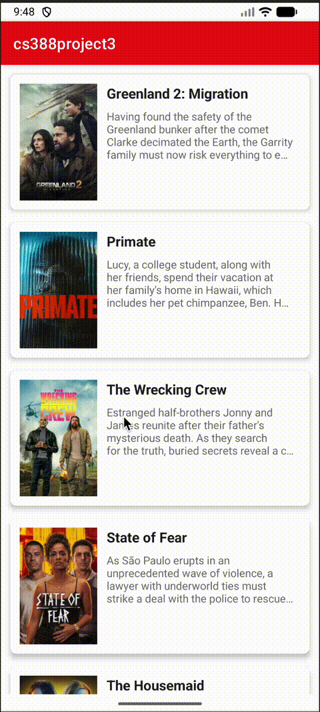
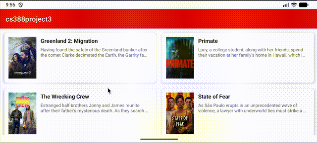

# FlixsterPlus

Submitted by: Justin Cordova

**FlixsterPlus** is a movie browsing app that allows users to browse movies currently playing in theaters.

Time spent: **4** hours spent in total

## Required Features

The following **required** functionality is completed:

- [x] **Make a request to [The Movie Database API's `now_playing`](https://developers.themoviedb.org/3/movies/get-now-playing) endpoint to get a list of current movies**
- [x] **Parse through JSON data and implement a RecyclerView to display all movies**
- [x] **Use Glide to load and display movie poster images**

The following **optional** features are implemented:

- [x] Improve and customize the user interface through styling and coloring
- [x] Implement orientation responsivity
  - App should neatly arrange data in both landscape and portrait mode

## Screenshots

## Notes

- Manual Parcelable implementation used instead of @Parcelize due to AGP 9.0.1 compatibility issues
- Custom placeholder drawables not implemented due to build compatibility (uses default ic_launcher_foreground)

## License

    Copyright 2025 Justin Cordova

    Licensed under the Apache License, Version 2.0 (the "License");
    you may not use this file except in compliance with the License.
    You may obtain a copy of the License at

        http://www.apache.org/licenses/LICENSE-2.0

    Unless required by applicable law or agreed to in writing, software
    distributed under the License is distributed on an "AS IS" BASIS,
    WITHOUT WARRANTIES OR CONDITIONS OF ANY KIND, either express or implied.
    See the License for the specific language governing permissions and
    limitations under the License.

## Getting Started

### Prerequisites

- Android SDK 24 or higher
- Android Studio Hedgehog or newer
- Internet connection (for fetching movies from TMDB API)

### Installation

1. Clone this repository
2. Open in Android Studio
3. Build: project
4. Run on an Android device or emulator

### API Configuration

The app uses [The Movie Database (TMDB) API](https://www.themoviedb.org/documentation/api) with the following configuration:

- **Base URL:** `https://api.themoviedb.org/3`
- **API Key:** Built-in (for development purposes)
- **Endpoint:** `/movie/now_playing`

### Architecture

The app follows a clean architecture with the following components:

- **MainActivity**: Orchestrates UI and fetches movie data
- **TmdbApi**: Singleton object for making API requests using AsyncHTTPClient
- **MovieAdapter**: RecyclerView adapter for displaying movie list
- **Movie**: Data model with Gson annotations for JSON parsing
- **MyAppGlideModule**: Glide configuration for image loading

### Tech Stack

- **Kotlin** - Primary development language
- **AsyncHTTPClient** (2.2.0) - Asynchronous network requests
- **Glide** (4.16.0) - Image loading and caching
- **Gson** (2.8.6) - JSON parsing
- **RecyclerView** (1.3.2) - Efficient list display
- **ConstraintLayout** - Flexible UI layout
- **Material Components** - Material Design components

### Libraries Used

- [AsyncHTTPClient](https://github.com/codepath/android-guides/blob/master/AsyncHTTPClient.md) - Easy HTTP requests for Android
- [Glide](https://bumptech.github.io/glide/) - Image loading and caching library
- [Gson](https://github.com/google/gson) - Java serialization/deserialization library
- [RecyclerView](https://developer.android.com/guide/topics/ui/layout/recyclerview) - Flexible view for providing a limited window into a large data set

## Features

- Browse currently playing movies from TMDB
- View movie posters, titles, and descriptions
- Scrollable list with smooth performance
- Beautiful card-based UI design
- Responsive layout (portrait: 1 column, landscape: 2 columns)
- Netflix-inspired color theme
- Material Design components

## Future Enhancements

Potential improvements for future versions:

1. Add movie details view
2. Implement search functionality
3. Add favorites/watchlist feature
4. Implement pull-to-refresh
5. Add infinite scroll pagination
6. Add filtering by genre
7. Add sorting options
8. Cache API responses for offline viewing
9. Add loading progress indicator
10. Add user feedback for network errors

## Known Issues

- Manual Parcelable implementation used instead of @Parcelize due to AGP 9.0.1 compatibility issues
- Custom placeholder drawables not implemented due to build compatibility (uses default ic_launcher_foreground)
- No loading state indicator
- No user feedback for API failures

## Contributing

Contributions are welcome! Please feel free to submit a Pull Request.

## References

- [The Movie Database API Documentation](https://www.themoviedb.org/documentation/api)
- [Android Developers Guide](https://developer.android.com/guide)
- [Material Design Guidelines](https://material.io/design)